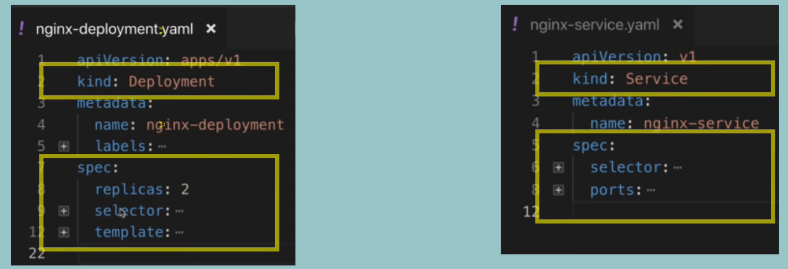
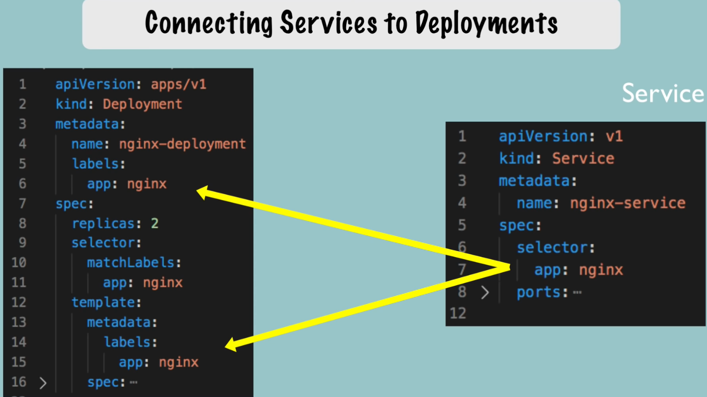
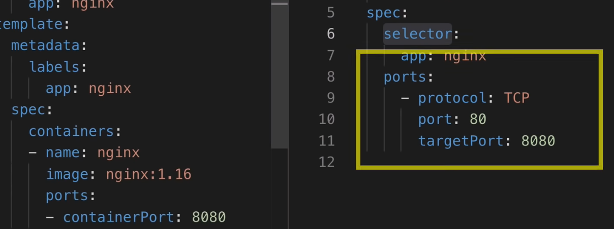
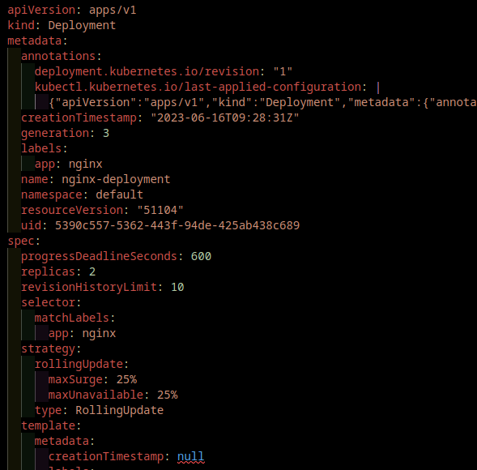

- ***Command used to download Youtube videos***
- `yt-dlp -f bestvideo+bestaudio/best https://youtu.be/X48VuDVv0do`
- make sure this is yt-dlp is the latest version
- /
- # Kubernetes (Nana)
- Full Kubernetes Tutorial | Kubernetes Course | Hands-on course with a lot of demos {{video https://www.youtube.com/watch?v=X48VuDVv0do}} 
  
  💙 Become a Kubernetes Administrator - CKA: [https://bit.ly/3MQtij9](https://bit.ly/3MQtij9)
  
  💚 Become a DevOps Engineer - full educational program: [https://bit.ly/3MRjKEE](https://bit.ly/3MRjKEE)
  
  🧡 Udemy courses: [https://bit.ly/3BQkjbz](https://bit.ly/3BQkjbz)
  
  #kubernetes #techworldwithnana
  
  Connect with me 👋
  
  INSTAGRAM ► [https://bit.ly/2F3LXYJ](https://bit.ly/2F3LXYJ)
  
  LINKEDIN ► [https://bit.ly/3hWOLVT](https://bit.ly/3hWOLVT)
  
  ▬▬▬▬▬▬ T I M E S T A M P S ⏰ ▬▬▬▬▬▬
  0:00 - Course Overview
  2:18 - What is K8s
  5:20 - Main K8s Components
  22:29 - K8s Architecture
  34:47 - Minikube and kubectl - Local Setup
  44:52 - Main Kubectl Commands - K8s CLI
  1:02:03 - K8s YAML Configuration File
  1:16:16 - Demo Project: MongoDB and MongoExpress
  1:46:16 - Organising your components with K8s Namespaces
  2:01:52 - K8s Ingress explained
  2:24:17 - Helm - Package Manager
  2:38:07 - Persisting Data in K8s with Volumes
  2:58:38 - Deploying Stateful Apps with StatefulSet
  3:13:43 - K8s Services explained
  
  ▬▬▬▬▬▬ COURSE OVERVIEW 📚 ▬▬▬▬▬▬
  🔥 What is Kubernetes 🔥 
  ► What problems does Kubernetes solve?
  ► What features do container orchestration tools offer?
  
  🔥 Main K8s Components 🔥
  ► Node & Pod
  ► Service & Ingress
  ► ConfigMap & Secret
  ► Volumes
  ► Deployment & StatefulSet
  
  🔥 K8s Architecture 🔥
  ► Worker Nodes
  ► Master Nodes
  ► Api Server
  ► Scheduler
  ► Controller Manager
  ► etcd - the cluster brain
  
  🔥 Minikube and kubectl - Local Setup 🔥
  ► What is minikube?
  ► What is kubectl?
  ► install minikube and kubectl
  ► create and start a minikube cluster
  
  🔗 Links:
  
  Install Minikube (Mac, Linux and Windows): [https://bit.ly/38bLcJy](https://bit.ly/38bLcJy)
  
  Install Kubectl: [https://bit.ly/32bSI2Z](https://bit.ly/32bSI2Z)
  
  Gitlab: If you are using Mac, you can follow along the commands. I listed them all here: [https://bit.ly/3oZzuHY](https://bit.ly/3oZzuHY)
  
  🔥 Main Kubectl Commands - K8s CLI 🔥
  ► Get status of different components
  ► create a pod/deployment
  ► layers of abstraction
  ► change the pod/deployment
  ► debugging pods
  ► delete pod/deployment
  ► CRUD by applying configuration file
  
  🔗 Links:
  
  Git repo link of all the commands: [https://bit.ly/3oZzuHY](https://bit.ly/3oZzuHY)
  
  🔥 K8s YAML Configuration File 🔥
  ► 3 parts of a Kubernetes config file (metadata, specification, status)
  ► format of configuration file
  ► blueprint for pods (template)
  ► connecting services to deployments and pods (label & selector & port)
  ► demo
  
  🔗 Links:
  
  Git repo link: [https://bit.ly/2JBVyIk](https://bit.ly/2JBVyIk)
  
  🔥 Demo Project 🔥
  ► Deploying MongoDB and Mongo Express
  ► MongoDB Pod
  ► Secret
  ► MongoDB Internal Service
  ► Deployment Service and Config Map
  ► Mongo Express External Service
  
  🔗 Links:
- Git repo link: [https://bit.ly/3jY6lJp](https://bit.ly/3jY6lJp)
  
  🔥 Organizing your components with K8s Namespaces 🔥
  ► What is a Namespace?
  ► 4 Default Namespaces
  ► Create a Namespace
  ► Why to use Namespaces? 4 Use Cases
  ► Characteristics of Namespaces
  ► Create Components in Namespaces
  ► Change Active Namespace
  
  🔗 Links:
  
  Install Kubectx: [https://github.com/ahmetb/kubectx#ins](https://github.com/ahmetb/kubectx#ins)...
  
  🔥 K8s Ingress explained 🔥
  ► What is Ingress? External Service vs. Ingress
  ► Example YAML Config Files for External Service and Ingress
  ► Internal Service Configuration for Ingress
  ► How to configure Ingress in your cluster?
  ► What is Ingress Controller?
  ► Environment on which your cluster is running (Cloud provider or bare metal)
  ► Demo: Configure Ingress in Minikube
  ► Ingress Default Backend
  ► Routing Use Cases
  ► Configuring TLS Certificate
  
  🔗 Links:
  
  Git Repo: [https://bit.ly/3mJHVFc](https://bit.ly/3mJHVFc)
  
  Ingress Controllers: [https://bit.ly/32dfHe3](https://bit.ly/32dfHe3)
  
  Ingress Controller Bare Metal: [https://bit.ly/3kYdmLB](https://bit.ly/3kYdmLB)
  
  🔥 Helm - Package Manager 🔥
  ► Package Manager and Helm Charts
  ► Templating Engine
  ► Use Cases for Helm
  ► Helm Chart Structure
  ► Values injection into template files
  ► Release Management / Tiller (Helm Version 2!)
  
  🔗 Links:
  
  Helm hub: [https://hub.helm.sh/](https://hub.helm.sh/)
  
  Helm charts GitHub Project: [https://github.com/helm/charts](https://github.com/helm/charts)
  
  Install Helm: [https://helm.sh/docs/intro/install/](https://helm.sh/docs/intro/install/)
  
  🔥 Persisting Data in K8s with Volumes 🔥
  ► The need for persistent storage & storage requirements
  ► Persistent Volume (PV)
  ► Local vs Remote Volume Types
  ► Who creates the PV and when?
  ► Persistent Volume Claim (PVC)
  ► Levels of volume abstractions
  ► ConfigMap and Secret as volume types
  ► Storage Class (SC)
  
  🔗 Links:
  
  Git Repo: [https://bit.ly/2Gv3eLi](https://bit.ly/2Gv3eLi)
  
  🔥 Deploying Stateful Apps with StatefulSet 🔥
  ► What is StatefulSet? Difference of stateless and stateful applications
  ► Deployment of stateful and stateless apps
  ► Deployment vs StatefulSet
  ► Pod Identity
  ► Scaling database applications: Master and Worker Pods
  ► Pod state, Pod Identifier
  ► 2 Pod endpoints
  
  🔥 K8s Services 🔥
  ► What is a Service in K8s and when we need it?
  ► ClusterIP Services
  ► Service Communication
  ► Multi-Port Services
  ► Headless Services
  ► NodePort Services
  ► LoadBalancer Services
-
- ## ==K8S Main Components== (00:22:29)
	- ***volumes***
	- ***configmap***
	- **secrets***
	- ***pod***
	- ***service***
	- ***ingress***
	- ***(deployment)***
	- ***(sts)***
-
- ## Minikube and kubectl - Local Setup (00:34:47)
- ### ==Worker Node Processes==
	- cri
	- kubelet
	- kubeproxy
- ### ==Master Processes==
	- api server  (cluster gateway & authentication gateway)
	- scheduler
	- controller manager
	- etcd  (cluster brain!)
- ## Main Kubectl Commands - K8s CLI  (00:44:52)
- ### minikube
- minikube start / stop / delete / status
- minikube dashboard (overview of env and can do more! - more later)
- example `minikube start --nodes 2 -p local-cluster  --disk-size='5gb' --driver=docker` (*optional is ---> namespace=learn*) --> careful here on what thew driver facilitates irt services!! e.g. quemu or quemu2
	- the input allow options such as namespave, disk alloc, driver to be use, etc.   `minikube start --help`
- `minikube status`
	- result are similar to:
		- minikube
		  type: Control Plane
		  host: Running
		  kubelet: Running
		  apiserver: Running
		  kubeconfig: Configured
- ### kubectl
- `kubectl version`
- create deployment   (abstraction over pods)
	- `kubectl create deployment nginx-depl --image=nginx` -- image can be versioned to nginx:1.16 as e.g.
	- with the result of a pod instance
	- Note: kubctl create deployment .........results in:
		- blueprint for creating pods
		- most basic configuration for deployment (name and image to be used)
		- rest are defaults (unless specified)
- `kubectl get deployment`
	- NAME         READY   UP-TO-DATE   AVAILABLE   AGE
	  nginx-depl   1/1          1                     1                    19s
- `kubectl get pod`
	- NAME                                           READY   STATUS    RESTARTS   AGE
	  nginx-depl-56cb8b6d7-pwlmz   1/1         Running    0                  34m
- `kubectl exec -it nginx-depl-56cb8b6d7-pwlmz -- bin/bash`
	- root@nginx-depl-56cb8b6d7-pwlmz:/#   ---> this allows root control of pod itself
- `kubectl edit deployment`
	- ```0 # Please edit the object below. Lines beginning with a '#' will be ignored,
	   # and an empty file will abort the edit. If an error occurs while saving this file will be
	   # reopened with the relevant failures.
	   #
	   apiVersion: apps/v1
	   kind: Deployment
	   metadata:
	     annotations:
	       deployment.kubernetes.io/revision: "1"
	     creationTimestamp: "2023-06-15T16:44:19Z"
	     generation: 1
	     labels:
	       app: nginx-depl
	     name: nginx-depl
	     namespace: default
	     resourceVersion: "579"
	     uid: 6275d61d-07e6-4f0f-85ed-2501e40ce828
	   spec...
	  ```
	-
- Note: the kubectl deployment can be manipulated by:
	- `kubectl create deployment ...`
	- `kubectl edit deployment ...`
	- `kubectl delete deployment ...`
	-
- `kubectl get replicaset`
	- NAME                               DESIRED   CURRENT   READY   AGE
	  nginx-depl-56cb8b6d7   1                1                  1             53m
-
- Note: By editing the deployment replicasets and/or other configs realising in the outcome desired
- ***Note:***
	- Deployment manages a ..
	  Replicaset manages a ..
	  Pod is an abstraction of ..
	  Container
- `kubectl apply -f config-file.yaml`
	- *deployment.apps/nginx-deployment created*
	  *deployment.apps/nginx-deployment configured*
	- Note the difference above - 1 to create and 1 to change the config
-
- Summary:  (01:01:43)
	- Status of different K8s components:
		- kubectl get nodes | service | replicaset | deployment
	- Debugging pods:
		- log to console ---> `kubectl logs nginx-deployment-68d9b6c666-ksx2w` [pod name]
		- `kubectl describe pod nginx-deployment-68d9b6c666-ksx2w`
		- `kubectl exec -it inx-deployment-68d9b6c666-ksx2w -- bin/bash` ---> this is to get into pod instance
- TIP: To delete a Service OR/AND Pod OR/AND Deployment use:
	- `kubectl delete service nginx-service`
	- `kubectl delete pod nginx-service`
	- `kubectl delete deployment  nginx2-depl`
- ## K8s YAML Configuration File (01:02:03)
- ### Creating a yaml file
- Firstly there is always a Deployment and a Service yaml file (Need both)
	- Deployment to define what is to be instantiated
	- Service is to define how the Deployment is to be accessed
- 
- Metadata
- 
- Specification for Deployment and/or Service
- 
- Deployment and Service files (could include Mounting etc.)   Note the apiversion DIFFERENCE in format!
- 
- Attributes of "spec" are specific to kind of file (Deployment vs. Service)
- 3 parts!
	- 1. metadata
	  2. specification
	  3. status (Notice: automatically generated on instatiation by k8s)
- Note: all status is found in etcd
-
- 
- Note: the concept of spec within a spec  - this is the actual deployable config - same goes for the service spec
- ==etcd provides the "defaults" for all Deployments/Services==
- ### Blueprint for Pods (Templates)
- ==Structure of yaml file:==
	- ```
	  apiVersion:
	  kind:
	  metadata
	  spec
	  ```
- ### Template
- 
- Pod Specification
- ### Connecting components (labels, selectors and ports)
- 
- Connecting Deployments to Pods
- 
- Connecting Services to Deployments
- Note the Service selector allow access to the deployment at BOTH the Deployment level AND the Pod level - i.e. the Sevice is attached to all Deployment of nginx, which have a 1 or more Pod/s in it! Only then it is applied (This is the reason for the metadata labels and selector)
- 
- Note: The Deployment is the Internal port that 'nginx' is exposing whereas the Service maps the external access port (a la 80) and maps this to the containerPort (Deploy/Serv are 8080)
-
- # Reflect Deployment AND/OR Service
- `kubectl descibe service nginx-service`
- `kubectl describe deployment nginx-deploy`
- this reconciles with the source yaml files.   Check this out!
-
- AND use `kubectl get pod -o wide` to reconcile the S is attched to the correct Pod IPs
- AND use `kubectl get deployment nginx-deployment -o yaml` to look at the deployment in yaml format - as below: ---> Note this is returned from etcd
	- ;
- NOTE: By deleting the source file the deployment/service is "removed"
	- `kubectl delete -f nginx-deployment.yaml`
	- `kubectl delete -f nginx-service.yaml`
	- Note: be careful as this is not production method as in production all sources are in git!