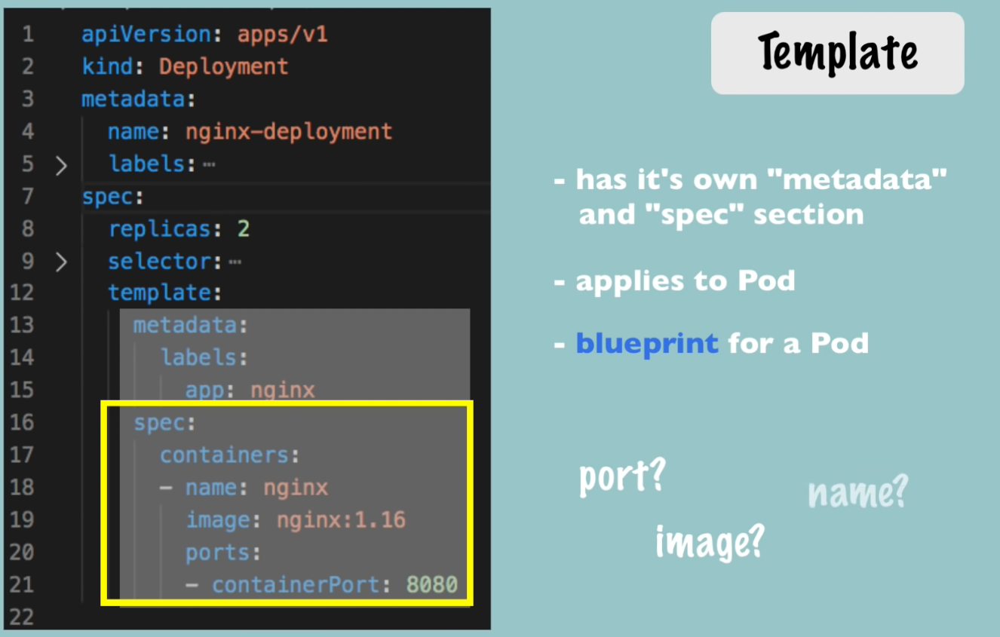

- [[Download Youtube Videos]]
- [[Kubernetes (Nana)]]
- # Kubernetes (Nana)
- ▬▬▬▬▬▬ COURSE OVERVIEW 📚 ▬▬▬▬▬▬
- [[What is Kubernetes]]
	- [[N Main K8s Components]]
	- [[N K8s Architecture]]
	-
-
- ## ==K8S Main Components== (00:22:29)
	- ***volumes***
	- ***configmap***
	- **secrets***
	- ***pod***
	- ***service***
	- ***ingress***
	- ***(deployment)***
	- ***(sts)***
-
- ## Minikube and kubectl - Local Setup (00:34:47)
- ### ==Worker Node Processes==
	- cri
	- kubelet
	- kubeproxy
- ### ==Master Processes==
	- api server  (cluster gateway & authentication gateway)
	- scheduler
	- controller manager
	- etcd  (cluster brain!)
	- ## Main Kubectl Commands - K8s CLI  (00:44:52)
- ### minikube
- minikube start / stop / delete / status
- minikube dashboard (overview of env and can do more! - more later)
- example `minikube start --nodes 2 -p local-cluster  --disk-size='5gb' --driver=docker` (*optional is ---> namespace=learn*) --> careful here on what thew driver facilitates irt services!! e.g. quemu or quemu2
	- the input allow options such as namespave, disk alloc, driver to be use, etc.   `minikube start --help`
- *==Tips:==*
	- create additional worker nodes e.g. `minikube node add --worker -p local-cluster` ---> local-cluster is a node name
	- `minikube  addons enable metrics-server -p local-cluster` to generate metrics for dashboard
	- `minikube dashboard --url -p local-cluster`
	- `minikube addons enable ingress-p local-cluster` ---> allow ingress point into minikube
	- *==Note:==* the `-p local-cluster` to apply to the correct cluster!!
- `minikube status`
	- result are similar to:
		- minikube
		  type: Control Plane
		  host: R
		-
		- unning
		  kubelet: Running
		  apiserver: Running
		  kubeconfig: Configured
- ### kubectl
- 
- `kubectl version`
- create deployment   (abstraction over pods)
	- `kubectl create deployment nginx-depl --image=nginx` -- image can be versioned to nginx:1.16 as e.g.
	- with the result of a pod instance
	- Note: kubctl create deployment .........results in:
		- blueprint for creating pods
		- most basic configuration for deployment (name and image to be used)
		- rest are defaults (unless specified)
- `kubectl get deployment`
	- NAME         READY   UP-TO-DATE   AVAILABLE   AGE
	  nginx-depl   1/1          1                     1                    19s
- `kubectl get pod`
	- NAME                                           READY   STATUS    RESTARTS   AGE
	  nginx-depl-56cb8b6d7-pwlmz   1/1         Running    0                  34m
- `kubectl exec -it nginx-depl-56cb8b6d7-pwlmz -- bin/bash`
	- root@nginx-depl-56cb8b6d7-pwlmz:/#   ---> this allows root control of pod itself
- `kubectl edit deployment`
	- ```yaml
	  # Please edit the object below. Lines beginning with a '#' will be ignored,
	   # and an empty file will abort the edit. If an error occurs while saving this file will be
	   # reopened with the relevant failures.
	   #
	   apiVersion: apps/v1
	   kind: Deployment
	   metadata:
	     annotations:
	       deployment.kubernetes.io/revision: "1"
	     creationTimestamp: "2023-06-15T16:44:19Z"
	     generation: 1
	     labels:
	       app: nginx-depl
	     name: nginx-depl
	     namespace: default
	     resourceVersion: "579"
	     uid: 6275d61d-07e6-4f0f-85ed-2501e40ce828
	   spec...
	  ```
- ==Tip:==
	- To generate a core yaml file for an image type do as per e.g. below:
	- `run nginx --image=nginx --dry-run=client -o YAML > zxc.yaml` # there is also -dry-run=server
- Note: the kubectl deployment can be manipulated by:
	- `kubectl create deployment ...`
	- `kubectl edit deployment ...`
	- `kubectl delete deployment ...`
	-
- `kubectl get replicaset`
	- NAME                               DESIRED   CURRENT   READY   AGE
	  nginx-depl-56cb8b6d7   1                1                  1             53m
-
- Note: By editing the deployment replicasets and/or other configs realising in the outcome desired
- ***Note:***
	- Deployment manages a ..
	  Replicaset manages a ..
	  Pod is an abstraction of ..
	  Container
- `kubectl apply -f config-file.yaml`
	- *deployment.apps/nginx-deployment created*
	  *deployment.apps/nginx-deployment configured*
	- Note the difference above - 1 to create and 1 to change the config
-
- Summary:  (01:01:43)
	- Status of different K8s components:
		- kubectl get nodes | service | replicaset | deployment
	- *==Debugging pods:==*
		- log to console ---> `kubectl logs nginx-deployment-68d9b6c666-ksx2w` [pod name]
		- `kubectl describe pod nginx-deployment-68d9b6c666-ksx2w`
		- `kubectl exec -it nginx-deployment-68d9b6c666-ksx2w -- bin/bash` ---> this is to get into pod instance
		- `kubectl exec -it nginx-deployment-68d9b6c666-ksx2w -c nginx-container -- bin/bash`---> this is to access the nginx in the pod instance
		- `kubectl port=forward service/nginx-service 8083:8080` ---> means you now can access the service  via the  browser: localhost:8083 - this will show nginx
- *==TIP:==* To delete a Service OR/AND Pod OR/AND Deployment use:
	- `kubectl delete service nginx-service`
	- `kubectl delete pod nginx-service`
	- `kubectl delete deployment  nginx2-depl`
- ### Managing Deployments
	- *==TIP:==*
		- `kubectl delete all --all` means all resources in namespace are deleted
		- Always leverage the apply - f filename.yaml rather than cli
	- ### History and reversion
	- `kubectl rollout history deployment/mongodb-deployment`---> provides the history of the deployment
	- `~kubectl rollout undo deployment/mongodb-deployment --to-revision=2`---> revert to a specific version
	-
- ## K8s YAML Configuration File (01:02:03)
- [[Creating a yaml file]]
- ### Creating a yaml file
- Firstly there is always a Deployment and a Service yaml file (Need both)
	- Deployment to define what is to be instantiated
	- Service is to define how the Deployment is to be accessed
- 
- Metadata
- 
- Specification for Deployment and/or Service
- 
- Deployment and Service files (could include Mounting etc.)   Note the apiversion DIFFERENCE in format!
- 
- Attributes of "spec" are specific to kind of file (Deployment vs. Service)
- 3 parts!
	- 1. metadata
	  2. specification
	  3. status (Notice: automatically generated on instatiation by k8s)
- Note: all status is found in etcd
-
- 
- Note: the concept of spec within a spec  - this is the actual deployable config - same goes for the service spec
- ==etcd provides the "defaults" for all Deployments/Services==
- ### Blueprint for Pods (Templates)
- ==Structure of yaml file:==
	- ```yaml
	  apiVersion:
	  kind:
	  metadata:
	  spec:
	  ```
- *==Tip:==*
	- use `kubectl api-resources | grep deployment`  ---> (or service /  secret / configmap / pods)
- ### Template
- 
- Pod Specification
- ### Connecting components (labels, selectors and ports)
- 
- Connecting Deployments to Pods
- 
- Connecting Services to Deployments
- Note the Service selector allow access to the deployment at BOTH the Deployment level AND the Pod level - i.e. the Sevice is attached to all Deployment of nginx, which have a 1 or more Pod/s in it! Only then it is applied (This is the reason for the metadata labels and selector)
- 
- Note: The Deployment is the Internal port that 'nginx' is exposing whereas the Service maps the external access port (a la 80) and maps this to the containerPort (Deploy/Serv are 8080)
-
- # Reflect Deployment AND/OR Service
- `kubectl describe service nginx-service`
- `kubectl describe deployment nginx-deploy`
- this reconciles with the source yaml files.   Check this out!
-
- AND use `kubectl get pod -o wide` to reconcile the S is attched to the correct Pod IPs
- AND use `kubectl get deployment nginx-deployment -o yaml` to look at the deployment in yaml format - as below: ---> Note this is returned from etcd
	-  /
	- View of deployment
- NOTE: By deleting the source file the deployment/service is "removed"
	- `kubectl delete -f nginx-deployment.yaml`
	- `kubectl delete -f nginx-service.yaml`
	- Note: be careful as this is not production method as in production all sources are in git!