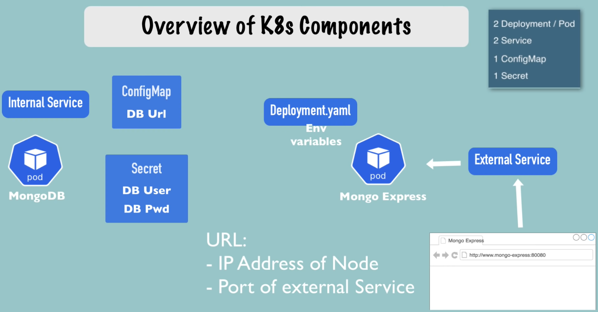

- ## Demo Project: MongoDB and MongoExpress  (01:16:16)
- ### Scope
	-  Overview of K8s Components](/home/briandanks/Pictures/Screenshots/Screenshot from 2023-06-20 13-42-30.png)
	- Overview of K8s Components
	-
	- Deployment  = 2 Pod
	- Service = 2
	- Configmap = 1
	- Secret = 1
	- - Leveraging MongoDB and MongoExpress
- (01:22:37) Create and manage Secrets (type Opaque -default for arbitrary key:value pair)
- (01:23:04) Create the Secret (base64 encoded keys)
	- `echo -n 'username' | base64`
	- `echo -n 'password' | base64`
	- Note use proper UID and PWd in reality
- Note:  the Order Matters (follow order below!)
	- create secret first
	- deployment
	- service
- To include secret into deployment:
- 
- 1:38:08
- In example mongodb and mongo-express the order is specific
	- firstly: (Mongdb)
		- create secret first
		- deployment
		- service
	- secondly:
		- create configmap first
		- deployment
	- Note: the database url is the mongo-service (it knows how to get to the mongodb)
- When all defined the external service is invoked `minikube service mongoexpress-service.yaml`; this will appear in the browser  OR
- `minikube service list`
- |-------------|----------------------|--------------|---------------------------|
  |  NAMESPACE  |         NAME         | TARGET PORT  |            URL            |
  |-------------|----------------------|--------------|---------------------------|
  | default     | kubernetes           | No node port |                           |
  | default     | mongodb-service      | No node port |                           |
  | default     | mongoexpress-service |         8081 | http://192.168.49.2:30000 |
  | kube-system | kube-dns             | No node port |                           |
  |-------------|----------------------|--------------|---------------------------|
- e.g Use `http://192.168.49.2:30000` and have access
- Note: all external ports are 30000 and above